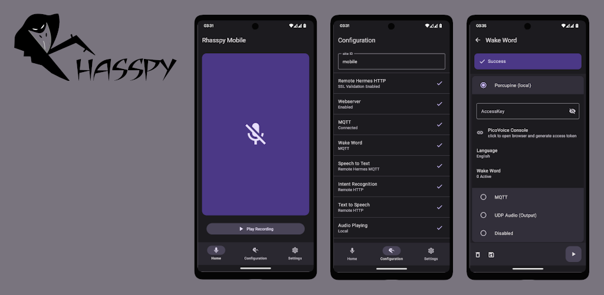

# Rhasspy mobile

This will be a Rhasspy satellite on a mobile phone. The original idea is
from [rhasspy-mobile-app](https://github.com/razzo04/rhasspy-mobile-app). The latest Version can be found on the [PlayStore](https://play.google.com/store/apps/details?id=org.rhasspy.mobile.android) or in [Releases](https://github.com/Nailik/rhasspy_mobile/releases).

### Contribution

Check out the project [Board](https://github.com/users/Nailik/projects/1) for open tasks, open a discussion or create your own pull-request. 
I am also happy for any feedback.

## Getting Started

For setup of server and satellite configuration check the official documentation
of [Rhasspy](https://rhasspy.readthedocs.io/en/latest/tutorials/#server-with-satellites).

## Main features

| Feature                           | Description                                                                                                                                                        |
|-----------------------------------|--------------------------------------------------------------------------------------------------------------------------------------------------------------------|
| Local wake-word                   | Uses [Porcupine](https://picovoice.ai/platform/porcupine/) to enable local wake-word processing                                                                    |
| Background Service                | Allows to run the app continuously in Background, listening for wake word and processing audio.                                                                    |
| Microphone Overlay and Widget     | Quick access to voice commands without using a wake-word.                                                                                                          |
| Indication                        | Indicate different Rhasspy states <ul><li>Wake up display when wake-word is detected</li><li>Sound indication like Rhasspy</li><li>Overlay animation</li></ul> |
| Automatic local silence detection | Stop recording audio when silence is detected with custom audio level.                                                                                             |
| Test configuration                | Test Rhasspy configuration while editing to simpler setup everything correctly.                                                                                    |
| Save and restore settings         | Don't loose the Satellite configuration.                                                                                                                           |
| Local Webserver                   | Hosts Hermes api to send commands to Rhasspy Satellite.                                                                                                            |

## Rhasspy configuration

| Item               | Options                                                                                                 |
|--------------------|---------------------------------------------------------------------------------------------------------|
| Site ID            | Setup the siteId, used for MQTT Messages to interact with Rhasspy Base.                                 |
| Remote Hermes HTTP | Path for HTTP Services, SSL Certification validation can be disabled to allow self signed certificates. |
| Webserver          | Hosts Hermes api to send commands to Rhasspy Satellite.                                                 |
| MQTT               | Connects to your MQTT broker to use the Rhasspy MQTT API or Services via MQTT.                          |
| Wake-word          | Enables to listen for wake-word locally or with a Rhasspy service.                                      |
| Speech to Text     | Translate Speech to Text via Rhasspy.                                                                   |
| Intent Recognition | Recognize an Intent from the Text via Rhasspy.                                                          |
| Text to Speech     | Convert Text to Speech via Rhasspy and play it locally.                                                 |
| Audio Playing      | Play audio locally as media or notification or remote.                                                  |
| Dialog Management  | Manage Dialog Handling locally or via MQTT.                                                             |
| Intent Handling    | Send Intents to Home Assistant or Rhasspy.                                                              |

# About

This idea was born because [rhasspy-mobile-app](https://github.com/razzo04/rhasspy-mobile-app) seems 
abandoned and not easy maintainable. It's for the many smart home users that have their Android Tablet 
to control their home and want to be able to use Rhasspy voice assistant.
